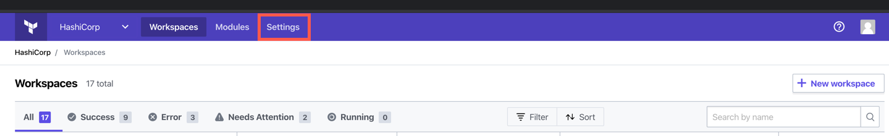
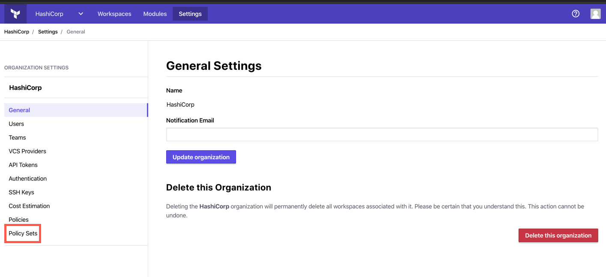
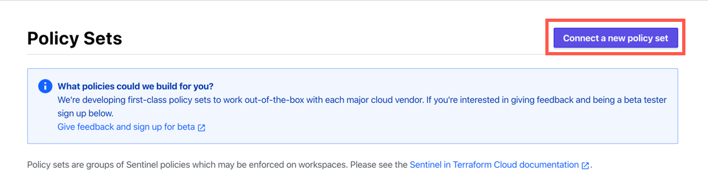
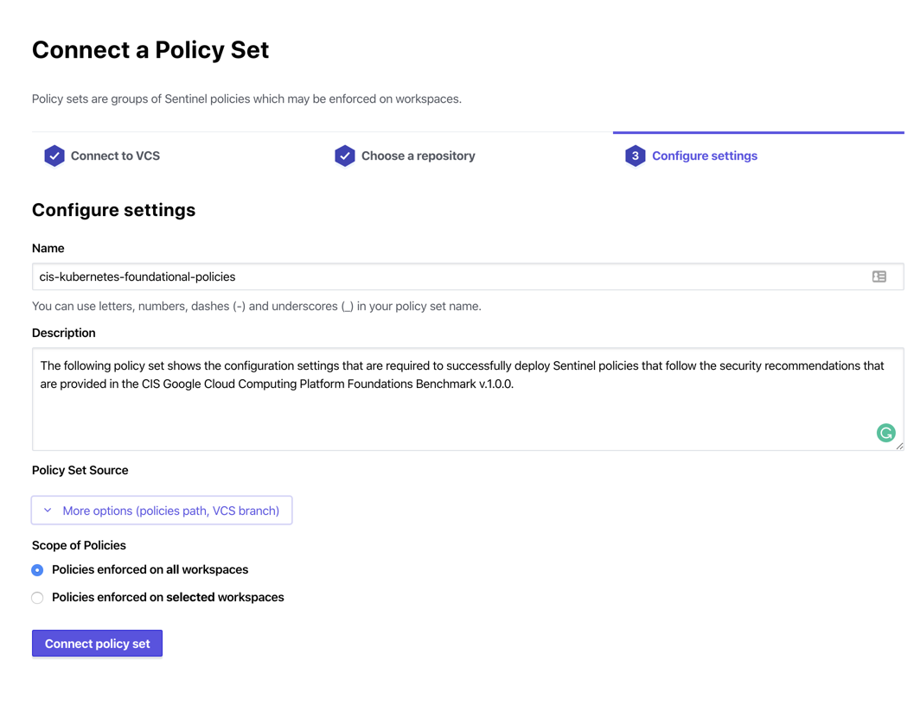
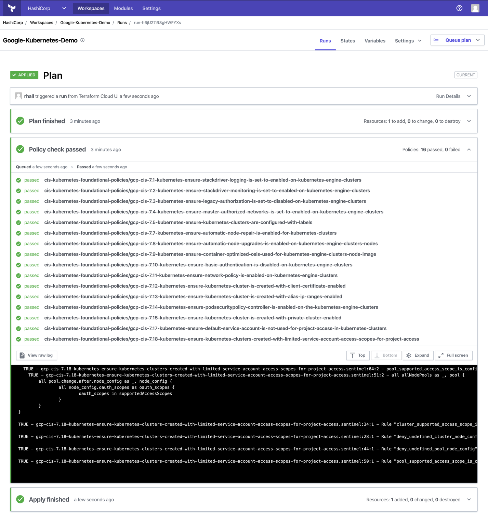

# Terraform Foundational Policies Library

This repository contains a library of policies that can be used within Terraform Cloud to accelerate your adoption of policy as code. To learn more about the Sentinel language and framework, please review the Sentinel [documentation](https://docs.hashicorp.com/sentinel/).

---

## Table of Contents
- [Prerequisites](#Prerequisites)
- [Documentation](#documentation)
- [Setup & Integration](#setup--integration)
- [Version Control System (VCS)](#version-control-system-vcs)
- [Policy Set Configuration](#policy-set-configuration)
- [Policy Set Management](#policy-set-management)
- [Policy Guides](#policy-guides)
- [Useful Resources](#useful-resources)

---

## Prerequisites

↥ [back to top](#table-of-contents)

Before you start adopting some of the policies within this library, it is recommended that you do the following:

1. [Install](https://docs.hashicorp.com/sentinel/intro/getting-started/install/) the Sentinel CLI. The CLI is an excellent tool for familiarizing yourself with the internals of Sentinel and allows you to `apply` and `test` policies outside of the Terraform platform. You can find more information related to the Sentinel CLI in the [Enforce Policy with Sentinel](https://learn.hashicorp.com/tutorials/terraform/policy-quickstart?in=terraform/cloud-get-started) learning track.

3. Enable the _Governance and Policy Plan_ in Terraform Cloud.
4. Have access to a [supported](https://www.terraform.io/docs/cloud/vcs/index.html#supported-vcs-providers) version control system (VCS) provider.

> **NOTE:** The Governance and Policy Plan is a _paid_ plan in Terraform Cloud. You can learn more about changing your payment plan by reviewing the [Changing Your Payment Plan](https://www.terraform.io/docs/cloud/paid.html#changing-your-payment-plan) sections in the Terraform Cloud documentation.

---

## Documentation

↥ [back to top](#table-of-contents)

The file and directory structure within this repository has been designed to have a descriptive `ROOT` directory that contains all policies that are related to a given standard. As an example, all policies for the Center for Internet Security Benchmarks are all located within the `cis` directory. Policies are then broken down by cloud service provider (i.e. AWS, Azure and GCP) and then categorized by cloud service (i.e. Compute, Databases, Networking etc.)

```ruby
.
└── ROOT
    └── CLOUD
       └── CATEGORY
           └── POLICY
               └── ...
```

All `CATEGORY` related directories contain a single `README.md` that details all information that is required to assess and enforce a policy in Terraform Cloud. This information includes:
- Policy name
- Description of the controls that are evaluated
- The Policy Set configuration that needs to be added to the `sentinel.hcl` file.

> **Note:** You can find a full list of all available policies in the [Policy Guides](#policy-guides) section.

---

## Setup & Integration

↥ [back to top](#table-of-contents)

Before you can use any of the policies within this library, you will need to configure Terraform Cloud. The following sections detail the high-level steps required to deploy a policy from the foundational policies library. The [Enforce Policy with Sentinel](https://learn.hashicorp.com/terraform?track=sentinel#sentinel) learning track covers the end-to-end process in greater detail. If this is the first time you are setting up a Sentinel policy, we encourage you to familiarize yourself with this track prior to continuing further.

### Version Control System (VCS)
Terraform Cloud provides first-class support for VCS integration. This allows VCS repositories to contain all of the policies and configuration needed to manage Sentinel policy at scale. [Integrating with VCS](https://www.terraform.io/docs/cloud/getting-started/policies.html#integrating-with-vcs) is as simple as:

1. [Connect a VCS Provider to Terraform Cloud](https://www.terraform.io/docs/cloud/vcs/index.html)
1. Create a repository in your VCS provider that will be used as the source of your Policy Set configuration
1. Clone the source repository to a local directory

### Policy Set Configuration

Once the VCS is integrated with Terraform Cloud, start to configure your Terraform Policy Set as follows:

1. Identifying a policy from the foundational policies library that should be enforced on a Terraform [Workspace](https://www.terraform.io/docs/cloud/workspaces/index.html)
1. Review the policy documentation and copy the configuration snippet for the policy of choice.
1. Create a `sentinel.hcl` configuration file within the local directory for your repository.
1. Edit the contents of the `sentinel.hcl` by pasting the configuration snippet into the body of the configuration file.
1. Commit your changes to your local repository content and then use the `git push` command to upload the changes to your remote repository.

> **Example Snippet**
>
> ```hcl
>policy "gcp-cis-7.1-kubernetes-ensure-stackdriver-logging-is-set-to-enabled-on-kubernetes-engine-clusters" {
>    source = "https://raw.githubusercontent.com/hashicorp/terraform-foundational-policies-library/master/cis/gcp/kubernetes/>gcp-cis-7.1-kubernetes-ensure-stackdriver-logging-is-set-to-enabled-on-kubernetes-engine-clusters/gcp-cis-7.>1-kubernetes-ensure-stackdriver-logging-is-set-to-enabled-on-kubernetes-engine-clusters.sentinel"
>    enforcement_level = "advisory"
>}
>
>policy "gcp-cis-7.2-kubernetes-ensure-stackdriver-monitoring-is-set-to-enabled-on-kubernetes-engine-clusters" {
>    source = "https://raw.githubusercontent.com/hashicorp/terraform-foundational-policies-library/master/cis/gcp/kubernetes/>gcp-cis-7.2-kubernetes-ensure-stackdriver-monitoring-is-set-to-enabled-on-kubernetes-engine-clusters/gcp-cis-7.>2-kubernetes-ensure-stackdriver-monitoring-is-set-to-enabled-on-kubernetes-engine-clusters.sentinel"
>    enforcement_level = "advisory"
>}
>
>policy "gcp-cis-7.3-kubernetes-ensure-legacy-authorization-is-set-to-disabled-on-kubernetes-engine-clusters" {
>    source = "https://raw.githubusercontent.com/hashicorp/terraform-foundational-policies-library/master/cis/gcp/kubernetes/>gcp-cis-7.3-kubernetes-ensure-legacy-authorization-is-set-to-disabled-on-kubernetes-engine-clusters/gcp-cis-7.>3-kubernetes-ensure-legacy-authorization-is-set-to-disabled-on-kubernetes-engine-clusters.sentinel"
>    enforcement_level = "advisory"
>}
>
>...
>```


### Policy Set Management

Now that the Policy Set is configured, it is time to enforce this configuration on a Terraform Cloud workspace. This is achieved by:

1. Browsing to your Terraform Cloud organization settings



2. Browse to Policy Sets settings



3. Connect a new Policy Set



4. Configure the Policy Settings (i.e. name, source, path, branch & workspace scope) and apply the settings



To test the configuration, navigate to the target workspace and queue a new plan. The policy check phase should now appear in the run details, and see the newly created policy will execute and return the state of the policy evaluation (i.e. `Pass` or `Fail`).

The image below shows the output of an example policy evaluation:



---

## Policy Guides

↥ [back to top](#table-of-contents)

### Center for Internet Security (CIS)
- Amazon Web Services
    - [Networking](cis/aws/networking/README.md)
- Microsoft Azure
    - [Compute](cis/azure/compute/README.md)
    - [Databases](cis/azure/databases/README.md)
    - [Networking](cis/azure/networking/README.md)
    - [Storage](cis/azure/storage/README.md)
- Google Cloud Platform
    - [Compute](cis/gcp/compute/README.md)
    - [Databases](cis/gcp/databases/README.md)
    - [Kubernetes](cis/gcp/kubernetes/README.md)
    - [Networking](cis/gcp/networking/README.md)
    - [Storage](cis/gcp/storage/README.md)

---

## Useful Resources

↥ [back to top](#table-of-contents)

- [Getting Started with Terraform Cloud](https://www.terraform.io/docs/cloud/getting-started/index.html)
- [Configuring Version Control Access](https://www.terraform.io/docs/cloud/getting-started/vcs.html)
- [Configuring Sentinel Policies](https://www.terraform.io/docs/cloud/getting-started/policies.html)
- [Sentinel Overview](https://www.terraform.io/docs/cloud/sentinel/index.html)
- [Example Policies](https://www.terraform.io/docs/cloud/sentinel/examples.html)
- [Sentinel Documentation](https://docs.hashicorp.com/sentinel/)
- [Sentinel Language](https://docs.hashicorp.com/sentinel/language/)
- [Sentinel Language Specification](https://docs.hashicorp.com/sentinel/language/spec/)

---
